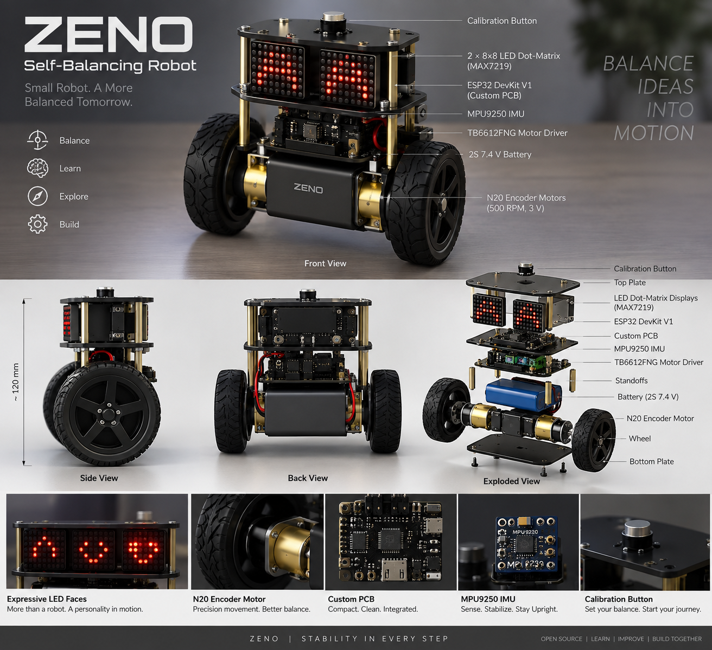

🤖 ZENO — Self-Balancing Robot

  

  <b>Balance Ideas Into Motion.</b> 
  ESP32 • MPU9250 • PID Control • N20 Encoder Motors • TB6612FNG • Custom CAD/PCB • Web Dashboard

📌 About ZENO

ZENO is a compact two-wheeled self-balancing robot developed as a hands-on platform for embedded systems, feedback control, sensor fusion, motor control, mechanical design, PCB development, and robot–user interaction.

The robot uses an ESP32 DevKit V1 as the main controller, an MPU9250 IMU to estimate body tilt, and two N20 3 V 500 RPM geared DC motors with encoders driven by a TB6612FNG dual motor driver. A PID controller continuously calculates the correction required to keep the robot close to its calibrated upright angle.

The repository also contains the current mechanical design files, 3D-printable parts, a PCB placement/connectivity draft, individual hardware test programs, and the main balancing firmware.

✨ Key Features

Two-wheel real-time self-balancing

ESP32-based embedded control

MPU9250 accelerometer and gyroscope sensing

Complementary-filter angle estimation

PID balance control

N20 encoder motor drive

Serial-command control and PID tuning

IMU calibration routine

Forward, reverse, left, and right movement commands

Automatic motor shutdown beyond a configured fall angle

Modular two-layer mechanical chassis

Custom PCB development files

3D-printable motor cap, base, top deck, and threaded spacers

MAX7219 LED matrix hardware provision for expressive robot eyes

Web-dashboard concept for telemetry, visualization, control, and tuning

🧠 Control Architecture

MPU9250 IMU
    │
    ▼
Accelerometer + Gyroscope
    │
    ▼
Complementary Filter
    │
    ▼
Estimated Pitch Angle
    │
    ▼
Target Angle − Current Angle
    │
    ▼
PID Controller
    │
    ▼
Motor PWM + Direction
    │
    ▼
TB6612FNG Motor Driver
    │
    ▼
N20 Encoder Motors
    │
    └──────── Encoder Feedback ────────┐
                                      │
                                      ▼
                                 ESP32 Control

The current firmware uses starting PID values of:

Kp = 22.0
Ki = 0.0
Kd = 0.85

These are starting values only and must be tuned for the final ZENO mechanical configuration.

🔩 Main Hardware

Component

Specification

Main controller

ESP32 DevKit V1

IMU

MPU9250

Motor driver

TB6612FNG

Motors

2 × N20 3 V 500 RPM geared DC motors

Feedback

Motor encoder signals

Robot eyes

2 × MAX7219 8×8 LED matrix modules

Battery system

Protected 2S battery pack

Nominal battery voltage

7.4 V

Fully charged voltage

8.4 V

ESP32 / display rail

Regulated 5 V

Motor rail

Regulated nominal 3 V

Logic rail

ESP32 3.3 V

PCB outline

Approx. 130 × 77 mm

The motor supply and regulator current capability must be selected using the measured motor stall current. Do not power the stated 3 V motors directly from the raw 2S battery.

🔌 ESP32 Pin Mapping

MPU9250

Signal

ESP32

SDA

GPIO 22

SCL

GPIO 23

I2C address

0x68

TB6612FNG

Signal

ESP32

PWMA

GPIO 25

AIN1

GPIO 26

AIN2

GPIO 27

STBY

GPIO 32

BIN1

GPIO 14

BIN2

GPIO 13

PWMB

GPIO 33

Encoder Input Currently Used by Main Firmware

Signal

ESP32

Encoder A

GPIO 19

Encoder B

GPIO 18

🎮 Serial Commands

The main firmware supports interactive control through the Arduino Serial Monitor.

Command

Function

C

Calibrate IMU

B

Enable balancing

S

Stop balancing

F

Move forward

R

Move backward

L

Turn left

T

Turn right

X

Stop movement

P

Print PID values

I

Increase Kp

i

Decrease Kp

O

Increase Ki

o

Decrease Ki

D

Increase Kd

d

Decrease Kd

⚖️ Calibration and Balancing

Before balancing, place ZENO in the intended upright position and send:

C

The firmware calibrates the IMU and establishes the angle reference. Once calibration is complete, balancing can be enabled with:

B

The robot continuously compares the current tilt with the target angle and applies motor corrections. The current firmware contains a 40° fall-angle safety threshold; when the robot exceeds this angle, motor drive is stopped to reduce uncontrolled motion.

🖥️ ZENO Web Dashboard

ZENO is also being developed with a dedicated web dashboard for a more intuitive robot-monitoring and control experience. The dashboard is intended to complement the ESP32 firmware and Serial Monitor rather than replace firmware-side safety logic.

Planned / Supported Dashboard Areas

Animated 3D ZENO introduction

Light and dark themes

Robot connection state

Balance state

Live pitch / tilt angle

Target angle and PID error

Kp, Ki, and Kd visualization

Left and right motor output

Encoder count / wheel-speed telemetry

IMU acceleration and angular velocity

Battery / power status

Calibration control

Start / stop balancing

Manual movement controls

Emergency-stop interface

Real-time telemetry graphs

PID tuning controls

3D robot orientation visualization

Dashboard Data Flow

ZENO Hardware
     │
     ▼
ESP32 Firmware
     │
     ├── IMU Data
     ├── PID Data
     ├── Encoder Data
     ├── Motor Output
     └── System Status
            │
            ▼
     Wi-Fi / WebSocket
            │
            ▼
      ZENO Dashboard
            │
      ┌─────┴─────┐
      ▼           ▼
 Telemetry      Control

Repository note: the uploaded repository snapshot currently contains the firmware, CAD/3D files, PCB draft, and image assets. The dashboard source is not yet included in this snapshot. Add it under a dedicated Dashboard/ or dashboard/ directory when integrating the web application.

🧱 Mechanical Design

ZENO uses a modular two-layer structure.

Base Layer

The lower section is intended to carry:

N20 motors

Wheels

Battery / battery holder

Motor mounting parts

Structural mounting points

Top Layer

The upper section is intended to carry:

Custom PCB

ESP32 DevKit V1

TB6612FNG

MPU9250

Display modules

Calibration button

The repository includes printable and editable mechanical files for the robot base, top deck, N20 motor cap, deck spacers, and assembly references.

🧩 Repository Structure

Zeno_SBR/
│
├── 3D/
│   ├── 3D print/
│   │   ├── ZENO_base.stl
│   │   ├── top_deck.stl
│   │   ├── N20_single_cap_1.STL
│   │   └── deck_spacer_50mm_M3_threaded.stl
│   │
│   ├── ZENO_Base_Mounting_Holes/
│   ├── ZENO_N20_Single_Cap/
│   ├── ZENO_PCB_Draft/
│   └── ZENO_Top_Layer/
│
├── Code/
│   ├── Motor_Test/
│   │   └── Motor_Test.ino
│   ├── MPU9250/
│   │   └── MPU9250.ino
│   └── ZENO_code/
│       └── ZENO_code.ino
│
└── ZENO.png

After adding the web application, a recommended extension is:

├── Dashboard/
│   ├── src/
│   ├── public/
│   ├── package.json
│   └── README.md

📁 Important Repository Files

Code/Motor_Test/Motor_Test.ino

Used to verify TB6612FNG wiring and basic motor direction/control independently of the balancing loop.

Code/MPU9250/MPU9250.ino

Used to test MPU9250 communication, calibration, and orientation measurement separately.

Code/ZENO_code/ZENO_code.ino

Current integrated ZENO balancing firmware containing IMU acquisition, calibration, complementary filtering, PID calculations, motor control, encoder input, serial commands, and fall protection.

3D/3D print/

Contains the primary STL files intended for fabrication/3D printing.

3D/ZENO_PCB_Draft/

Contains the current KiCad placement and connectivity draft.

⚠️ PCB Development Status

The included ZENO Rev A PCB is a placement/connectivity draft and is currently marked:

UNROUTED — NOT FOR FABRICATION

The PCB files must be fully verified before manufacturing. Required work includes:

Verify physical module footprints and pin order

Confirm motor and encoder electrical requirements

Verify ESP32 footprint spacing

Verify connector families and orientation

Add routing, vias, and copper zones

Add a continuous ground reference

Check ESP32 antenna clearance

Verify motor-current trace width

Complete schematic/ERC verification

Run KiCad DRC

Generate and inspect Gerbers only after validation

Do not submit the current PCB draft directly for fabrication.

🚀 Running the Firmware

Install the ESP32 board package in the Arduino IDE.

Connect the ESP32 DevKit V1.

Open:

Code/ZENO_code/ZENO_code.ino

Select the appropriate ESP32 board and COM/serial port.

Compile and upload the firmware.

Open Serial Monitor.

Keep the robot supported safely with wheels free during initial testing.

Send C to calibrate.

Verify angle direction and motor direction before enabling balance mode.

Tune PID values gradually for the final mechanical build.

🧪 Recommended Testing Sequence

1. Verify regulated power rails
        ↓
2. Test MPU9250 communication
        ↓
3. Run Motor_Test.ino
        ↓
4. Confirm both motor directions
        ↓
5. Verify encoder response
        ↓
6. Upload integrated ZENO firmware
        ↓
7. Calibrate IMU
        ↓
8. Verify tilt-angle direction
        ↓
9. Test balancing while physically supported
        ↓
10. Tune PID parameters
        ↓
11. Perform controlled free-balance tests
        ↓
12. Integrate live dashboard telemetry

🛠️ Development Roadmap

Mechanical base design

Top deck design

N20 motor mounting design

M3 threaded spacer design

MPU9250 test firmware

Motor test firmware

Integrated balancing firmware

Serial-based PID adjustment

Fall-angle protection

Initial PCB placement/connectivity draft

Tune PID on the completed mechanical robot

Validate both motor encoders independently

Complete and route PCB

Fabricate and test custom PCB

Integrate MAX7219 eye animations into main firmware

Add Wi-Fi/WebSocket telemetry

Add dashboard source to repository

Connect dashboard to live ESP32 data

Add battery monitoring

Add OTA firmware updates

Add advanced motion/position control

🎯 Applications and Learning Outcomes

ZENO can be used to explore:

Self-balancing robotics

Inverted-pendulum control

Embedded C/C++ programming

ESP32 development

PID control

Sensor fusion

IMU calibration

DC motor control

Encoder feedback

PCB design

CAD and 3D printing

Power-system integration

Web-based robot telemetry

Human–robot interaction

⚠️ Safety

ZENO contains moving motors and a rechargeable battery system. During development:

Verify regulator outputs before connecting electronics.

Use a protected battery pack.

Keep a physical power-disconnect method available.

Do not test balancing near edges or fragile objects.

Support the chassis during initial PID tuning.

Confirm motor direction before enabling closed-loop balancing.

Do not treat a web-based emergency-stop button as a substitute for hardware power isolation.

📈 Project Status

Active Development

The mechanical design, test firmware, integrated balancing firmware, and initial PCB draft are present in this repository. PID tuning, PCB completion, display integration, wireless telemetry, and web-dashboard integration remain active development areas.

📜 Disclaimer

ZENO is an educational and experimental robotics project. Hardware dimensions, electrical connections, PCB footprints, power-system limits, PID parameters, and software should be independently verified before fabrication or operation.

🤝 Contributions

Suggestions, improvements, testing feedback, and contributions are welcome as the ZENO platform develops.

  <b>ZENO</b> 
  <i>Balance Ideas Into Motion.</i>

